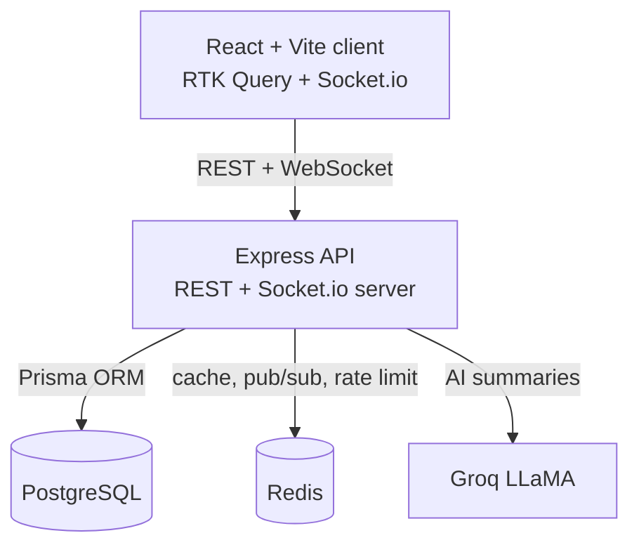

# Architecture

## Overview

A single Express application exposes a REST API and also hosts a Socket.io
WebSocket server. Prisma is the data-access layer over PostgreSQL. Redis serves
three purposes: the Socket.io pub/sub adapter (so real-time events work across
multiple instances), a cache for AI summaries, and the store for rate limiting.



## Request lifecycle (write path)

Every write follows the same shape:

`request -> JWT check -> validation -> service -> Prisma write -> emit event -> respond`

When a task is created or updated, the service writes to Postgres and then emits
a `task:created` / `task:updated` event into the `project:<id>` Socket.io room.
Every client viewing that board receives it and patches its local cache, so the
board updates live without polling.

## Layers

- `routes`   - HTTP method + path, attaches auth / validation / rate-limit middleware
- `controller` - reads the request, calls the service, shapes the response
- `service`  - business logic, Prisma access, emits real-time events
- `config`   - Prisma client, Redis clients, environment loading
- `middleware` - auth (JWT), validation (Zod), rate limiting, error handling
- `sockets`  - Socket.io setup with the Redis adapter and an `emitToProject` helper

## Data model

- `User` 1—* `ProjectMember` *—1 `Project`  (membership join table)
- `Project` 1—* `Task`
- `Task` *—1 `User` (assignee, nullable)

See `prisma/schema.prisma` for the full definition.

## Search

Full-text search uses PostgreSQL `to_tsvector` / `plainto_tsquery` over task
title and description, restricted to projects the requesting user belongs to,
ranked by `ts_rank`. For larger datasets, add a GIN index:

```sql
CREATE INDEX task_fts_idx ON "Task"
USING GIN (to_tsvector('english', title || ' ' || coalesce(description, '')));
```

## AI summaries

`POST /api/projects/:id/summary` gathers the project's tasks, checks Redis for a
cached summary keyed by a hash of the task list, and on a miss calls Groq, caches
the result for 10 minutes, and returns it. Without a `GROQ_API_KEY` it returns a
computed offline summary so the endpoint always works.
